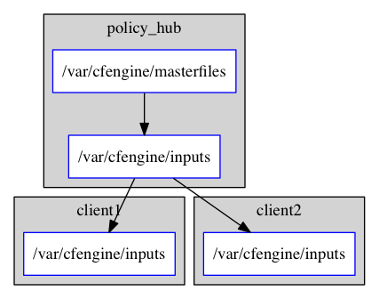

% CF-Primer: Zero to Hero
% Brian Bennett <bahamat@digitalelf.net>, @bahamat
  with Aleksey Tsalolikhin <aleksey@verticalsysadmin.com>, @atsaloli
% 2018-02-06

# Welcome!

<!--
Copyright 2013 Brian Bennett

Licensed under the Apache License, Version 2.0 (the "License");
you may not use this file except in compliance with the License.
You may obtain a copy of the License at

    http://www.apache.org/licenses/LICENSE-2.0

Unless required by applicable law or agreed to in writing, software
distributed under the License is distributed on an "AS IS" BASIS,
WITHOUT WARRANTIES OR CONDITIONS OF ANY KIND, either express or implied.
See the License for the specific language governing permissions and
limitations under the License.
-->

**CFEngine** is a powerful language for controlling all aspects of a system.  CFEngine runs primarily on UNIX and UNIX like operating systems, but can also run on Windows.

CFEngine is very extensive and powerful. Today you will learn only a subset of what CFEngine can do. A mere tip of the iceberg, but this will represent the bulk of what you do with CFEngine. In other words, you'll learn the 20% of CFEngine that will do 80% of the work.

After today you won't be a *ninja*. But you will be a *hero*. Want to know more? Get [on-site training](http://www.verticalsysadmin.com/cfengine/) from Vertical Sysadmin, read the [book](http://cf-learn.info/book/), work through the [tutorial](http://www.cfenginetutorial.org/), or just read the [reference manual][reference-manual].

# Fork Me on Github!

You can get a copy of this presentation any time on Github.

<http://github.com/bahamat/cf-primer>

This presentation will be updated in the future, but you can find the exact version used today tagged with today's date.

Aleksey has also prepared a [quick reference guide](http://www.verticalsysadmin.com/cfengine/primer.pdf).

# Components of CFEngine

These are the major components of CFEngine that you will encounter on a day to day basis. There are others, but you will rarely (if ever) use them.

* cf-agent
* cf-monitord
* cf-execd
* cf-serverd

However, you will almost always use only `cf-agent`.

# cf-agent

`cf-agent` is the command you will use most often. It is the command that is used to apply policies to your system. If you are running any CFEngine command from the command line, there's a greater than 99% chance that this is it.

# cf-monitord

`cf-monitord` monitors various statistics about the running system.

You'll almost never use `cf-monitord` directly. However the data provided by `cf-monitord` is available to `cf-agent` during policy execution.

# cf-execd

`cf-execd` is a periodic task scheduler. You can think of it like `cron` on steroids.

By default CFEngine runs and enforces policies every *five minutes*. `cf-execd` is resposible for making that happen.

# cf-serverd

`cf-serverd` runs on the CFEngine server, as well as all clients.

* On servers it is responsible for serving files to clients.
* On clients it accepts `cf-runagent` requests

What is `cf-runagent`? Look it up in the manual. You will probably never use it.

# Imperative vs. Declarative

It is very likely that you have only ever used **imperative** languages.

**imperative language:**

> Any programming language that specifies explicit manipulation of the state of the computer system

-- [Free Online Dictionary of Computing](http://foldoc.org/imperative)

Examples of imperative languages include C, Perl, Ruby, Python, shell scripting, etc. Name a language. It's probably imperative.

CFEngine is a **declarative** language. The CFEngine language is merely a *description* of the final state. CFEngine moves the system to the desired state and keeps it there.

# Imperative is Sequential

Imperative languages execute step by step in *sequence*.

Because it is sequential, it must go in order from start to finish. If a sequential program is interrupted in the middle the state is *inconsistent*. Neither at starting point nor at the finish. Executing the program again will repeat tasks that have already been done, possibly causing damage in doing so.

E.g., a script that appends a line to a file then restarts a daemon. If the line is appended but the daemon not restarted, running the script again will result in that line in the file twice. This will likely cause the daemon to fail when restarted.

Imperative starts at known state A and transforms to known state B.

# Declarative is Descriptive

Declarative moves from chaos to order. It is not a list of steps to achieve an outcome but a **description** of the desired state. Because of this any deviation from the desired state can be detected and corrected.

In other words, a declarative system can begin in *any* state, not simply a known state, and transform into the desired state.

Declarative states a list of things which must be true. It does not state how to make them true.

When a system has reached the desired state it is said to have **converged**, or reached **convergence**.

**Converge:**

> (of a number of things) gradually change so as to become similar or develop something in common.

-- [Oxford Dictionary](https://en.oxforddictionaries.com/definition/converge)

# Promise Theory

Promise theory is a model of voluntary cooperation between individual, autonomous actors or agents who publish their intentions to one another in the form of promises.

A file (e.g., `/etc/apache2/httpd.conf`) can make promises about its own contents, attributes, etc. But it does not make any promises about a process.

A process (e.g., `httpd`) can make a promise that it will be running. But it does not make any promises about its configuration.

Each of the configuration file and the process are *autonomous*. Each makes promises about itself which cooperates toward an end. Promise theory is the fundamental underlying philosophy that drives CFEngine.

# Promise Theory Book

To learn more about Promise Theory, read the book ["Thinking in Promises"](http://shop.oreilly.com/product/0636920036289.do), by Mark Burgess.

# Anatomy of a Promise

    type:
      context::
        "promiser" -> "promisee"
          attribute1 => "value",
          attribute2 => "value";

* **type** is the kind of promise being made (e.g., files, commands, etc.).
* **context** is an optional. Promises with a context will only apply if the given context is true (e.g., CentOS 6 servers, Web servers, servers in Seattle).
* **promiser** is what is making the promise. (e.g., a file or a process).
* **promisee** is an optional recipient or beneficiary of the promise (e.g., another system or organizational stakeholder).

# Anatomy of a Promise

    type:
      context::
        "promiser" -> "promisee"
          attribute1 => "value",
          attribute2 => name;

Each promise has a list of attributes that describe the parameters of the promise.  Every attribute is optional, and the available attributes will vary depending on the *promise type*.

The value can be either a text string (which must be quoted) or another object (which must not be quoted).

# Anatomy of a Promise

    type:
      context::
        "promiser" -> "promisee"
          attribute1 => "value",
          attribute2 => name;

All of the attributes together are called the **body** of the promise (as in "the body of an e-mail").

# Anatomy of a Promise

    type:
      context::
        "promiser" -> "promisee"
          attribute1 => "value",
          attribute2 => name;

Attributes are separated by *commas*. Each promise ends with a *semi-colon*.

# Anatomy of a Promise

Example:

    files:
      linux::
        "/tmp/hello/world" -> "Student"
          create => "true";

* This is a promise of **type** `files`.
* This promise has a **context** of `linux` (it will only apply if running a Linux kernel). This is also known as a **class** (a group of hosts having something in common).
* The **promiser** is the POSIX path `/tmp/hello/world`.
* This promise has only one **attribute**, specifying that the file should be created if it does not exist.
* The **promisee** is *you!*

# Anatomy of a Promise

Example:

    files:
      linux::
        "/tmp/hello/world" -> "Student"
          create => "true";

To create a directory instead, use a `files:` promise and append a `.` to the directory name (e.g., `"/tmp/hello/."`)

# Bundles

A **bundle** is a collection of **promises**. It is a logical grouping of any number of promises, usually for a common purpose (e.g., everything necessary for a Web site to function properly).

For example, a bundle to configure Apache might:

* install the apache2 package
* edit the configuration file
* copy the Web server content
* configure filesystem permissions
* ensure the `httpd` process is running
* restart the `httpd` process when necessary

# Anatomy of a Bundle

    bundle type name {

      type:
        context::
          "promiser" -> "promisee"
            attribute1 => "value",
            attribute2 => name;

      type:
        context::
          "promiser" -> "promisee"
            attribute1 => "value",
            attribute2 => name;

    }

Bundles apply to the binary that executes them. E.g., `agent` bundles apply to `cf-agent` while `server` bundles apply to `cf-serverd`.

Bundles of type `common` apply to any CFEngine binary.

For now you will only create `agent` or `common` bundles.

# Bodies

I stated before that the attributes of a promise, collectively, are called the body. The value of any one attribute can also be an external **body**.

A **body** is a collection of *attributes*. These are attributes that supplement the promise.

# Anatomy of a Body

    body type name {
      attribute1 => "value";
      attribute2 => name;
    }

The difference between a *bundle* and a *body* is that a bundle contains *promises* while a *body* contains only *attributes*.

Take a moment to let this sink in.

* A **bundle** is a collection of *promises*.
* A **body** is a collection of *attributes* that are applied to a promise.

The distinction is subtle, especially at first and many people are tripped up by this.

In a body each attribute ends with a *semi-colon*.

# Bundles & Bodies

Bundles and bodies can be created as reusable objects. In other words you can define one and then call it like a function, even passing in parameters which will implicitly become variables.

Here's an example:

    body type name (param) {
      attribute1 => "$(param)";
    }

The parameter `param` is accessed as a variable by `$(param)`. You can name your parameters anything you like.

# Bundles & Bodies

Example:

    bundle agent main {
      files:
          "/tmp/testfile"
            create => "true",
            perms => not_world_writable;
    }

    body perms not_world_writable {
            mode   => "o-w";
    }

Ensure `/tmp/testfile` exists, with specific permissions.

# The CFEngine Standard Library

The **CFEngine Standard Library** comes bundled with CFEngine in the `masterfiles/lib/` directory.

The standard library contains ready to use bundles and bodies that you can include in your promises and is growing with every version of CFEngine. Get to know the [standard library](https://github.com/cfengine/masterfiles/blob/master/lib/README.md) well, it will save you much time.

# Putting it All together

These are the building blocks. You now know what they all are.

### Congratulations!

You'll now be walked through some example bundles (and accompanying bodies) that will accomplish a single atomic task each.

In each example that includes a complete bundle, try running it on your virtual machine. Save all of the files for future ~~cannibalization~~ reference.

To execute a policy run the following command:

    $ cf-agent --file ./test.cf --bundle bundlename

**Note:** Make sure you use the correct file and bundle name!

# Set File Permissions

    bundle agent example {
      files:
        "/etc/shadow"     perms => perms_for_shadow_files;
        "/etc/gshadow"    perms => perms_for_shadow_files;
    }

    body perms perms_for_shadow_files {
      owners => { "root" };
      groups => { "shadow" };
      mode   => "0640";
    }

* This is an **agent** bundle (meaning that it is processed by `cf-agent`).
* Its purpose is to set the permissions on `/etc/shadow` and `/etc/gshadow`.
* It uses an external body named `perms_for_shadow_files`.
* The body only needs to be defined once and can be reused for any number of promises.

Note: The values for `owners` and `groups` is enclosed in curly braces. This is because these attributes take a list of strings (aka, an `slist`).

# Copy an Entire File

    bundle agent example {
      files:
        "/etc/motd"     copy_from => cp("/repo/motd");
    }

    body copy_from cp (from) {
      servers     => { "$(sys.policy_hub)" };
      source      => "$(from)";
      compare     => "digest";
    }

* The purpose of this bundle is to copy `/etc/motd` from the CFEngine server
* `$(sys.policy_hub)` is an automatic variable which contains the CFEngine server's address.
* The path `/repo/motd` is on the *server's* filesystem.
* The `compare` type tells CFEngine how to know when the file needs updating.

# Edit a File

    bundle agent example {
      files:
        "/etc/ssh/sshd_config"     edit_line => deny_root_ssh;
    }

    bundle edit_line deny_root_ssh {
      delete_lines:
        "^PermitRootLogin.*"
      insert_lines:
        "PermitRootLogin no"
    }

* This will delete any line matching the regular expression `^PermitRootLogin.*`.
* This also inserts the line `PermitRootLogin no` *at the end of the file*.
* CFEngine is smart enough to know not to edit the file if the end result is already **converged**.
* This is an overly simplistic example. When editing configuration files you probably want to copy the whole file or use `set_config_values()` from the standard library.

# Introduction to Classes

A **class** is like a tag (like tagging a photo). Classes are used to give a promise *context*. There are two types of classes.

1. **Built in classes**. These are classes that CFEngine will create automatically. Hard classes are determined based on the system attributes. For example a server running Linux will have the class `linux`.
2. **User defined classes**. These are classes that are defined by you. You can create them based on the outcome of a promise, based on the existence of other classes, or for no reason.

# Example Classes From a Live System

Here is a list of hard classes defined on an actual system running CFEngine.

    cf3>  -> Hard classes = { 127_0_0_2 2_cpus 32_bit April Day23 Evening GMT_Hr3
    Hr20 Hr20_Q3 Lcycle_0 Min30_35 Min31 PK_MD5_1a66e41f5cca80e636636702476cf925 Q3
    Tuesday Yr2013 any cfengine cfengine_3 cfengine_3_4 cfengine_3_4_3 common
    community_edition compiled_on_linux_gnu debian debian_6 debian_6_0 have_aptitude
    i686 ipv4_127 ipv4_127_0 ipv4_127_0_0 ipv4_127_0_0_2 linux linux_2_6_18_pony6_3
    linux_i686 linux_i686_2_6_18_pony6_3
    linux_i686_2_6_18_pony6_3__1_SMP_Tue_Mar_13_07_31_44_PDT_2012
    mac_00_00_00_00_00_00 net_iface_eth0 verbose_mode }

# Use Classes to Control Promise Selection

    bundle agent apache_config {
      files:

        debian::
          "/etc/apache2/apache2.conf"
            copy_from => remote_cp("/cfengine/repo/debian/apache2.conf","$(sys.policy_hub)");
        redhat::
          "/etc/httpd/conf/httpd.conf"
            copy_from => remote_cp("/cfengine/repo/redhat/httpd.conf","$(sys.policy_hub)");
        solaris::
          "/etc/apache2/2.2/httpd.conf"
            copy_from => remote_cp("/cfengine/repo/solaris/httpd.conf","$(sys.policy_hub)");

    }

This set of promises will copy the appropriate apache config file depending on the type of server. Notice that each file promise is prefixed by a *class*. The promise will be skipped unless that class is defined on the system.

Thus, only Debian systems will run the `debian::` context promise, only Red Hat will run `redhat::` and only Solaris will run `solaris::`.

# Promise Type and Class Context Can be Implicit

The **promise type** and **class context** don't need to be listed for every promise. Think of each like a heading in an outline. Everything that follows is still under the same heading until a new heading is declared. If a new promise type is declared the class context is reset as well.

    files:
      solaris::
        "/tmp/hello/world"
          create => "true";
        "/tmp/foo/bar"
          create => "true";
      linux::
        "/dev/shm/hello_world"
          create => "true";
    commands:
      "/bin/echo Hello World";

The first three promises are of type `files`. The first two will only execute on `solaris` while the third will only execute on `linux`. The last promise has a new promise type, of `commands`, and will always execute.

# A Note About Classes and Distributions Based on Other Distributions

I said that only Debian systems will run `debian::` and only Red Hat will run `redhat::`. This isn't exactly true.

* Ubuntu is based on Debian, and so will have both `ubuntu` and `debian` defined as hard classes.
* Likewise, CentOS is based on Red Hat and so will have both `centos` and `redhat` defined as hard classes.

This goes for any distro that is based on another distro. The "parent" classes will be also defined.

# Use Classes to Control Flow

    bundle agent apache_config {
      files:

        "/etc/apache2/apache2.conf"
          copy_from => remote_cp("/cfengine/repo/debian/apache2.conf","$(sys.policy_hub)")
            classes => if_repaired("RestartApache");

      commands:

        RestartApache::
          "/usr/sbin/apache2ctl graceful";
    }

This set of promises will first copy the Apache configuration file. Once the Apache configuration file is updated, Apache must be restarted. In order to make sure that Apache gets restarted when necessary a class will be defined when the configuration file is updated.

When CFEngine reaches the commands section, if the `RestartApache` class is defined (which only happens if the config file is updated) then Apache will be restarted.

# Use Classes to Control Flow

    bundle agent apache_config {
      files:

        "/etc/apache2/apache2.conf"
          copy_from => remote_cp("/cfengine/repo/debian/apache2.conf","$(sys.policy_hub)"),
            classes => if_repaired("RestartApache");

      commands:

        RestartApache::
          "/usr/sbin/apache2ctl graceful";
    }

So, the workflow then is:

1. Perform promise 1
2. Define a class if repaired
3. Perform promise 2 if the class has been set

I use this ALL. THE. TIME. If this class is to teach you 20% that accomplishes 80%, *this slide* is the 5% that accomplishes 95%.

# Compound Classes

      commands:
        RestartApache.debian::
          "/usr/sbin/apache2ctl graceful";
        RestartApache.redhat::
          "/usr/sbin/apachectl graceful";

This example is similar to the last one, except that Debian and Redhat each have different commands used to restart Apache. Therefore, we use a compound boolean class context. The expression `RestartApache.debian` means "RestartApache *and* debian".

# Compound Classes

      commands:
        RestartApache.debian::
          "/usr/sbin/apache2ctl graceful";
        RestartApache.redhat::
          "/usr/sbin/apachectl graceful";

  Operator       Meaning            Example
-------------    -----------        --------
  `.` and `&`       boolean *and*      `debian.Tuesday::`
  `|` and `||`      boolean *or*       `Tuesday|Wednesday::`
  `!`            boolean *not*      `!Monday::`
  `( )`          Explicit grouping  `(debian|redhat).!ubuntu.!centos::`

# Keep Services Running: Using Processes

    bundle agent apache {

    processes:

      "apache2"
        restart_class => "StartApache";

    commands:
      StartApache::
        "/etc/init.d/apache2 start";

    }

This policy uses a `processes` promise to check the process table (with `ps`) for the regular expression `.*apache2.*`. If it is not found then the class `StartApache` will get defined.

When CFEngine executes `commands` promises Apache will be started.

# Ensuring Processes are Not Running: Using Processes and Commands

    bundle agent stop_bluetooth {

      processes:

        "bluetoothd"
          process_stop => "/etc/init.d/bluetooth stop";
    }

This policy uses a `processes` promise to check the process table (with `ps`) for the regular expression `.*bluetoothd.*`. If it is found the `process_stop` command is executed.

# Ensuring Processes are Not Running: Using Processes and Signals

    bundle agent stop_bluetooth {

      processes:

        "bluetoothd"
          signals => { "term", "kill" };
    }

This policy uses a `processes` promise to check the process table (with `ps`) for the regular expression `.*bluetoothd.*`. Any matching process is sent the `term` signal, then sent the `kill` signal.

**Note:** The promise `"bluetoothd"` becomes the *regular expression*, `.*bluetoothd.*` that is matched against the output of `ps`. This means that it can match *anywhere* on the line, not just the process name field. *Caveat emptor!*

# Keep Services Running: Using Services

    bundle agent apache {
      services:

        "www"
          service_policy => "start";
    }

This uses the `services` promise type to ensure that Apache is always running. This only works for services that are defined under `standard_services` in the standard library and requires cfengine 3.4.0 or higher.

`services` promises currently only work on Linux and are distro-intelligent. That is, this promise example above works equally well on Debian/Ubuntu, Red Hat/CentOS or SUSE (and derived distros).

If you're not using one of these distros, or if you're using a Solaris or BSD based system you'll need to use processes promises.

# Ensuring Processes are Not Running: Using Services

    bundle agent stop_bluetoothd {
      services:

        "bluetoothd"
          service_policy => "stop";
    }

This policy uses a `services` promise type to ensure that Bluetooth services are not running. Again, this only works for services that are defined under `standard_services` in the standard library and requires cfengine 3.4.0 or higher.

The same restrictions about distros apply to stopping services promises.

# Package Management

    bundle agent install {
      packages:
        "zsh"
          policy  => "present",
          package_module  => apt_get,
          version => "4.3.10-4.1.el6";
    }

(Note: This is the modern style of packages promises, introduced in CFEngine 3.7; there is a different syntax for packages promises in 3.6 and earlier.  Check the docs if you haven't upgraded to 3.7 or later.)

The `policy` is the most important attribute.  It can be `"present"` or `"absent"`, depending on whether you want to install or uninstall.

The next attribute, `package_module`, specifies how CFEngine should interface with the system package manager.  Out of the box this can be `yum` or `apt_get`, and on some installations `freebsd_ports`, `pkgsrc` and others are available as well.

When `version` is left out CFEngine will only ever install or uninstall, but when `version` is set to a particular value like in the example shown, then CFEngine will upgrade **or downgrade** as needed to get that version.

If you only want to upgrade to the latest version, whatever that is, set `version => "latest"`.

And of course with `policy => "absent"` you can leave out `version` to ensure there isn't *any* version of the package present, or specify a version to blacklist (uninstall) just that particular version, if it's installed.  (You can't use `"absent"` with `"latest"`.)

# Deleting Files

    bundle agent tidy {
      files:
        "/var/log/.*"
          file_select => days_old("7"),
          delete => tidy;
    }

This policy will delete any files in `/var/log/` older than 7 days. The `days_old()` and `tidy` bodies are included in the standard library,

To delete a file indiscriminately, omit the `file_select`.

Look up [`file_select`][file_select] and [`tidy`][tidy] in the [CFEngine Reference Manual][reference-manual] to find more ways to use this.

[file_select]: https://docs.cfengine.com/lts/reference-promise-types-files.html#file_select
[tidy]: https://docs.cfengine.com/lts/reference-standard-library-files.html#tidy

# Setting Up a Client/Server Environment

Before starting you need to have cfengine installed on the server and the client and the server FQDN must be set properly in DNS (or use the IP addresses). This is ideally handled by your provisioning process. Along with automating server function you should also be automating your provisioning process.

Some ways of automating provisioning are [**kickstart**][ks], [**preseed**][ps], [**fai**][fai], [**cobbler**][cbl], [**disk imaging**][g4u], [**instance cloning**][ec2], etc, etc. This of course is not a complete list.

[ks]: http://fedoraproject.org/wiki/Anaconda/Kickstart
[ps]: http://wiki.debian.org/DebianInstaller/Preseed
[fai]: http://wiki.debian.org/FAI
[cbl]: http://www.cobblerd.org
[g4u]: http://www.osalt.com/g4u
[ec2]: http://aws.amazon.com/ec2/

# Bootstraping the Server and Client

#### Server Side

Edit `/var/cfengine/masterfiles/def.cf` to set the `"acl"` list for the IP addresses of your network, then run:

    cf-agent --bootstrap $(hostname --fqdn)
    cf-agent -KI

#### Client Side

Simply run:

    cf-agent --bootstrap server.fqdn.example.com

You can use the server's IP address instead of the DNS name.

# Distributing Policies

The policy files are distributed from `/var/cfengine/masterfiles` on the server (also known as the `policy_hub`).

Clients copy policy files from `/var/cfengine/masterfiles` on the server to `/var/cfengine/inputs`. CFEngine binaries read policy out of `/var/cfengine/inputs`.

Policy is cached locally in `/var/cfengine/inputs`. Clients can run CFEngine even when the server is unreachable, and update the cache opportunistically when they _can_ reach the server.

Now edit the policy in `/var/cfengine/masterfiles` on the server and watch for the changes to happen on the client.

# Adding Policies

As you write new policies, each bundle needs to be listed in the `bundlesequence` and each file needs to be listed in `inputs`. Both of these are under `body common control` inside of `promises.cf`.

Bundles are executed in the order they are listed in the `bundlesequence`, but `inputs` can be listed in any order.

Remember to make your changes in `/var/cfengine/masterfiles` on the server -- if you make them in `/var/cfengine/inputs`, they will get overwritten.

# Keep Track of Promises Repaired and Promises Not Repaired

CFEngine logs to `/var/cfengine/promise_summary.log`. Here's an example log message:

    1366956065,1366956068: Outcome of version Community Promises.cf 1.0.0
      (agent-0): Promises observed to be kept 100%, Promises repaired 0%,
      Promises not repaired 0%

**Note:** The timestamp is a Unix epoch.

CFEngine will also send an email to the configured address in `promises.cf` any time there is output from an agent run.

And finally you can use the `-I` flag to have CFEngine *inform* you of repairs. (Shown here along with the `-K` flag which ignores any lock timers).

    cf-agent -KI

# Debugging: Using Verbose Mode

Inevitably, something will go wrong. Lucky for you, CFEngine has fantastic debugging output. Use the `-v` flag to turn on verbose output. Again, using `-K` to disable locks is useful

    $ cf-agent -Kv

When viewing debug output, look for `BUNDLE <name>` of the bundle that you suspect is having trouble.

    cf3> *****************************************************************
    cf3> BUNDLE main
    cf3> *****************************************************************

CFEngine will tell you exactly what is going on with each promise.

    cf3>     Promise made by: "/var/spool/cron/crontabs/sys"
    cf3>
    cf3>  -> Using literal pathtype for /var/spool/cron/crontabs/sys
    cf3>  -> File "/var/spool/cron/crontabs/sys" exists as promised

# Debugging: Using Comments

CFEngine supports **comments** as part of its data structure. Every promise can have a `comment` attribute whose value is a quoted text string.

    "/etc/bind/named.cache"
      copy_from => scp("$(def.files)/bind/named.cache"),
      comment   => "More recent copy of named.cache than shipped with bind";

Comments show up in the verbose output.

    cf3>     Promise made by: "/etc/bind/named.cache"
    cf3>     Comment:  More recent copy of named.cache than shipped with bind

The comment should always be *why* the promise is being made. Up until now none of the examples have used comments to save space on the slide. When writing your policies for real *every* promise should have a meaningful comment.

You'll thank me when this saves the day.

# Debugging: Using Promise Handles

When debugging, promise **handles** are also useful. Again, every promise can have a `handle` attribute whose value is a quoted canonical string.

    "/etc/bind/named.cache"
      copy_from => scp("$(def.files)/bind/named.cache"),
      handle    => "update_etc_bind_named_cache",
      comment   => "More recent copy of named.cache than shipped with bind";

CFEngine will tell you the handle of each promise in the debug output.

    cf3>     Promise's handle: update_etc_bind_named_cache
    cf3>     Promise made by: "/etc/bind/db.root"
    cf3>     Comment:  More recent copy of named.cache than shipped with bind

By giving each promise a unique handle you can swiftly jump back and forth between your debug output and your policy file. When writing your policies for real *every* promise should have a unique handle.

You'll thank me when this saves the day.

# The Rest

Here's a list of topics that I didn't cover. This is to give you a taste of the rest of the power that is behind CFEngine. Dig deeper by checking them out in the [reference manual][reference-manual].

* `vars:` promises — Varables, strings, integers and reals (and lists of each).
* `methods:` promises — Create a self-contained bundle that can be called like a function.
* `guest_environments:` promises — Promise the existence of virtual machines.
* `storage:` promises — For local or remote (NFS) filesystems.
* `database` promises — Promise the schema of your database, CFEngine does the SQL for you.
* `edit_xml:` promises - Promise by path, CFEngine does the XML for you.
* `interfaces:` promises — Promise your network settings
* Monitoring — Using data from `cf-monitor`.
* Implicit looping — Pass a list to a promise and it loops over the values in the list.

# Pro Tips

* **Don't edit the standard library**. Create a `site_lib.cf` and add your custom library bundles and bodies there. This helps with upgrading because you won't have to patch your changes into the new version of the library. When you feel a bundle or body is ready for public use you can submit it to CFEngine by opening a pull request on [Github][masterfiles].
* **Make built-in classes and user defined classes easy to distinguish by sight.** CFEngine creates hard classes `all_lower_case_separated_by_underscores`. Whenever I define classes myself I use `CamelCase`.
* **Not sure how to organize `masterfiles`?** Check [A Case Study in CFEngine Layout][layout] by Brian Bennett.
* **Use `git`** to revision control `masterfiles`.
* **Syntax errors?** Only read the very first error. Fix it, then try again. A missing character in one promise will throw the whole file off.

[cfengine]: http://github.com/cfengine/core
[masterfiles]: http://github.com/cfengine/masterfiles
[layout]: https://digitalelf.net/2013/04/a-case-study-in-cfengine-layout/
[reference-manual]: https://docs.cfengine.com/lts/reference.html
